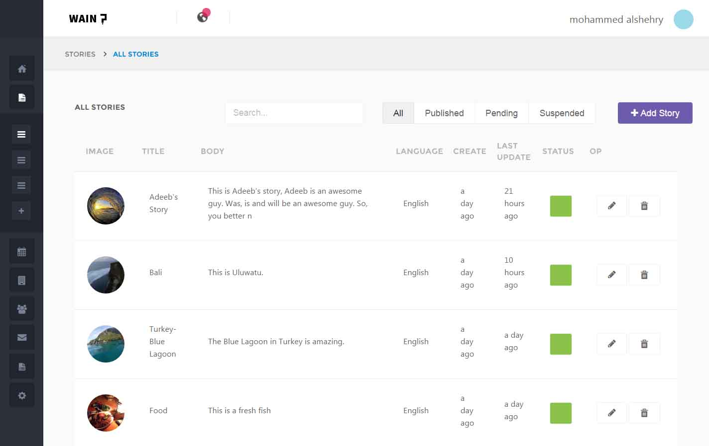

<h1>Welcome to MEAN.js</h1>

This project is Business site project using CMS.

In this project, I implemented different CMS functionalities using AngularJS. I also made models using MongoDB.

Vagrant Guide

<ul>
	<li>Start VBox : vagrant up</li>
	<li>Shut down VBox : vagrant halt</li>
</ul>